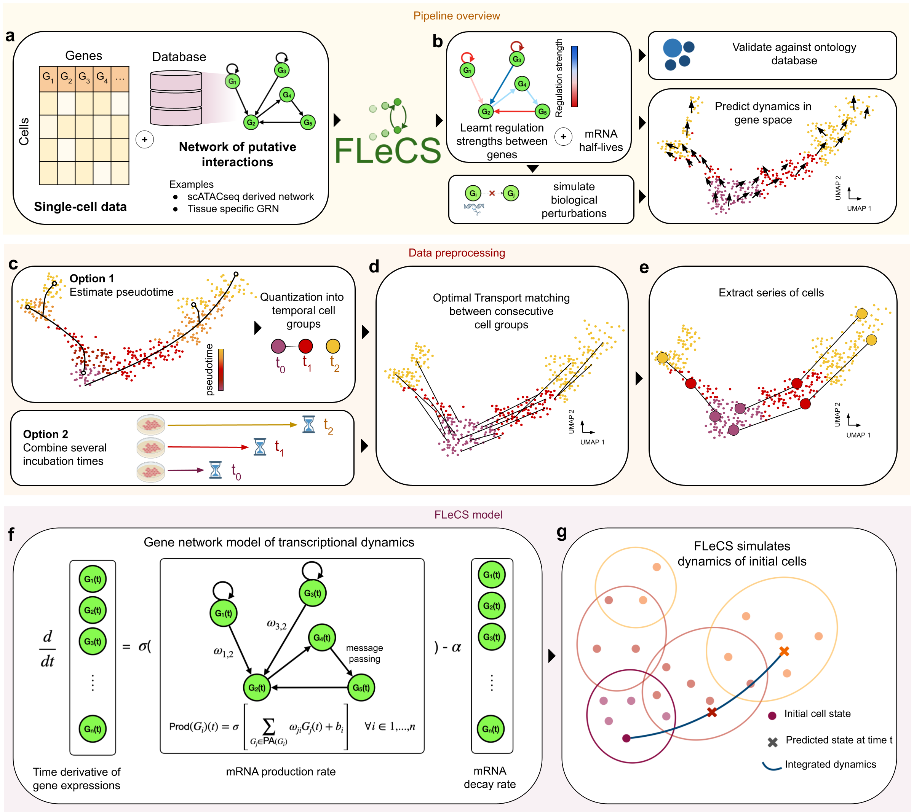

# FLeCS

**F**unctional and **Le**arnable **C**ell dynamic**S**


Repository for the preprint: [A scalable gene network model of regulatory dynamics in single cells](https://arxiv.org/abs/2503.20027).

## Overview



We introduce FLeCS, a functional and learnable model of cell dynamics that incorporates gene network structure into 
coupled differential equations. FLeCS: 
- accurately infers cell dynamics at scale
- provides improved functional insights into transcriptional mechanisms
- simulates single-cell trajectories

To quickly apply FLeCS to your own data, see the tutorial notebook at `notebooks/Tutorial.ipynb`.  
The tutorial uses a publicly available myeloid differentiation dataset (download link provided in the notebook) and 
should run in just a few minutes on a personal laptop.

## Installation
You need to have Python 3.8 or newer installed on your system. If you don't have
Python installed, we recommend installing [Mambaforge](https://github.com/conda-forge/miniforge#mambaforge).

### Conda

To install the conda environment on GPU, please run
```
conda env create -f environment_gpu.yml
conda activate flecs
pip install -e .
```

To install the conda environment on CPU, please run
```
conda env create -f environment_cpu.yml
conda activate flecs
pip install -e .
```

This installation should only take a few minutes on a personal laptop.

## Reproducibility

All scripts used to generate figures are provided in folders `FLeCS/figure<N>`.

## Documentation

Please refer to the [documentation][link-docs].


[link-docs]: https://bertinus.github.io/FLeCS/

## Citation

If you use FLeCS in your research, please cite the following preprint:

```
@misc{bertin2025scalablegenenetworkmodel,
      title={A scalable gene network model of regulatory dynamics in single cells}, 
      author={Paul Bertin and Joseph D. Viviano and Alejandro Tejada-Lapuerta and Weixu Wang and Stefan Bauer and Fabian J. Theis and Yoshua Bengio},
      year={2025},
      eprint={2503.20027},
      archivePrefix={arXiv},
      primaryClass={q-bio.MN},
      url={https://arxiv.org/abs/2503.20027}, 
}
```
